# Stock Logger

## Contributor:
#### Name: Prof. Cai Filiault

## Author:
#### Name: Ibrahim (Wusiman Yibulayin)
#### Student ID: 0728356

## Table of contents
* [Description](#description)
* [Getting Started](#getting-started)
* [Database](#database)
* [Prerequisites](#prerequisites)
* [Screen Shots](#screen-shots)
* [Acknowledgments](#acknowledgments)

## Description
When we are trading stocks, we need to calculate profit or loss.
Most stock trading software does not calculate the detailed costs.
In this app, you just need to log into your bought or sold stocks.
You can estimate the selling price by setting your willing profit.

## Getting Started
Stock Logger is an Android app, and it is very easy to use.
You can use this app to log your stock tradings. You can 
add stock which you bought in the stock market, and the app
will calculate the profit of that stock. you can increase and
decrease your holding stock's amount when you bought or sold some 
quantity of a spesific stock. You can log sold stocks in this app,
and the system will dipsplay them seperately. Because the user 
of this app only targetted the Canadians, so this app only record
stocks in the US stock market and Canada stock market. You should 
setup your brokerage's trading fee so that the app can caculate 
eactly worth price of a stokc. This app also provides some contact 
information on a contact page.

## Database
### Database Name: Stock
### Tables:
### 1. Stock Table
#### Table Name: stock
#### Table Columns:
<table>
    <tr>
        <th>Column Name</th>
        <th>Data Type</th>
    </tr>
    <tr>
        <td>ID</td>
        <td>int, Primary Key</td>
    </tr>
    <tr>
        <td>symbol</td>
        <td>Text</td>
    </tr>
    <tr>
        <td>company_name</td>
        <td>Text</td>
    </tr>
    <tr>
        <td>last_pricee</td>
        <td>Double</td>
    </tr>
    <tr>
        <td>worth</td>
        <td>Double</td>
    </tr>
    <tr>
        <td>quantity</td>
        <td>int</td>
    </tr>
    <tr>
        <td>is_usd</td>
        <td>int</td>
    </tr>
</table>

### 2. Active Stock Table
#### Table Name: active
#### Table Columns:
<table>
    <tr>
        <th>Column Name</th>
        <th>Data Type</th>
    </tr>
    <tr>
        <td>ID</td>
        <td>int, Primary Key</td>
    </tr>
    <tr>
        <td>symbol</td>
        <td>Text</td>
    </tr>
    <tr>
        <td>companyName</td>
        <td>Text</td>
    </tr>
    <tr>
        <td>price</td>
        <td>double</td>
    </tr>
    <tr>
        <td>quantity</td>
        <td>int</td>
    </tr>
    <tr>
        <td>bought_date</td>
        <td>TEXT</td>
    </tr>
</table>

### 3. Stock - Active Stock Relative Table
#### Table Name: stock_active
#### Table Columns:
<table>
    <tr>
        <th>Column Name</th>
        <th>Data Type</th>
    </tr>
    <tr>
        <td>stock</td>
        <td>int, forien key to stock table</td>
    </tr>
    <tr>
        <td>actie</td>
        <td>int, forien key to active table</td>
    </tr>
</table>

### 4. Sold Stock Table
#### Table Name: sold
#### Table Columns:
<table>
    <tr>
        <th>Column Name</th>
        <th>Data Type</th>
    </tr>
    <tr>
        <td>ID</td>
        <td>int, Primary Key</td>
    </tr>
    <tr>
        <td>symbol</td>
        <td>Text</td>
    </tr>
    <tr>
        <td>companyName</td>
        <td>Text</td>
    </tr>
    <tr>
        <td>soldPrice</td>
        <td>double</td>
    </tr>
    <tr>
        <td>earning</td>
        <td>double</td>
    </tr>
</table>

## Prerequisites
This application needs to install in an Android phone, and the Android version
is at least Android 4.4 (Kit Kat).

## Screen Shots

### Image of Menu Fragment
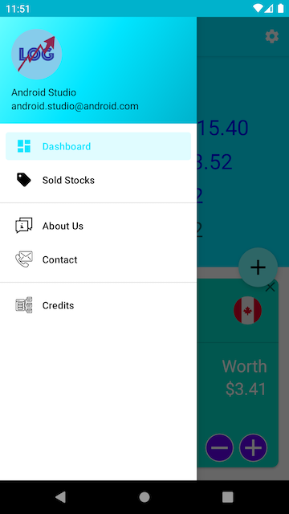

### Images of Dashboard(main) Fragment
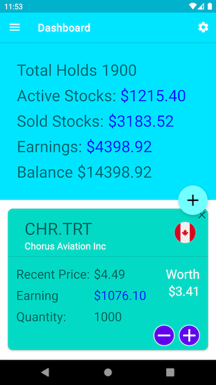
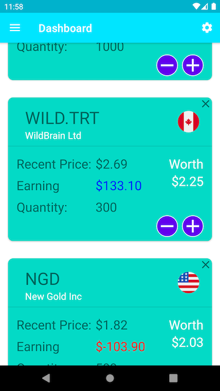

### Images of Add Stock Fragment
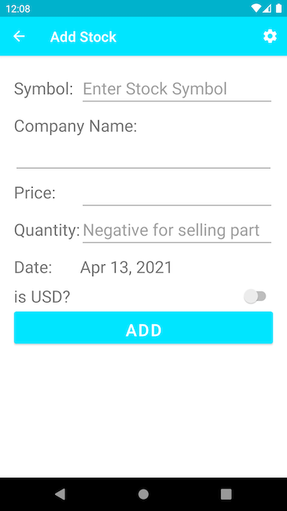
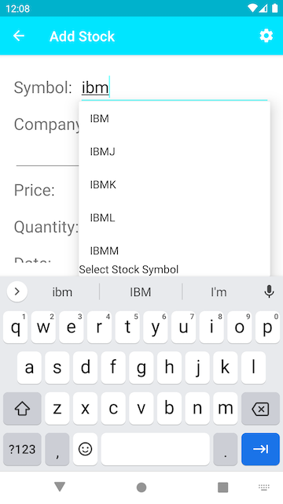

### Image of Sell Stock Fragment
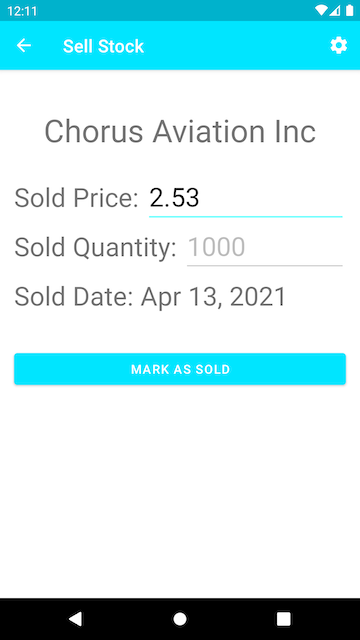

### Image of Sold Stock Fragment
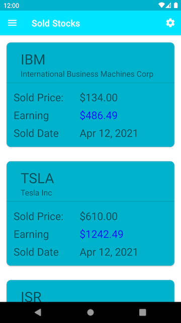

### Image of About Us Fragment
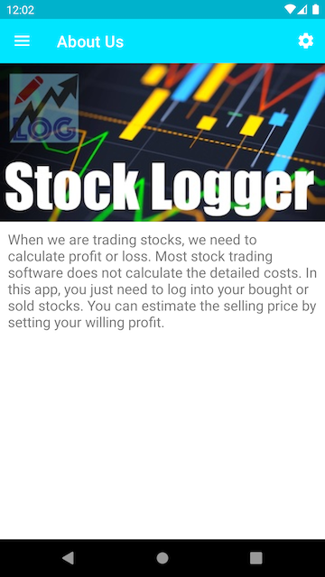

### Image of Contact Fragment
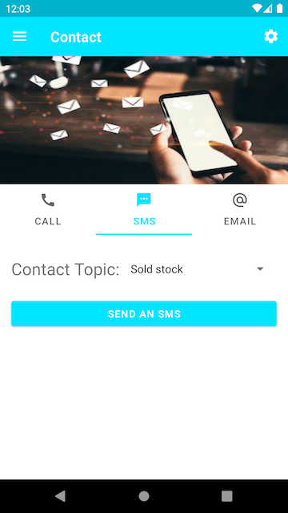

### Image of Credits Fragment
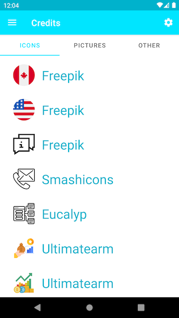

### Image of Setting Activity
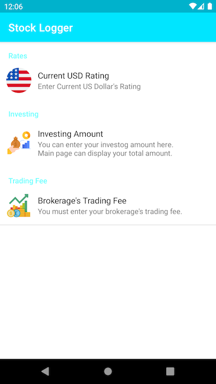

### Images of Tablet
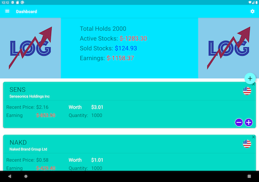

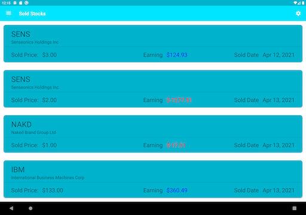

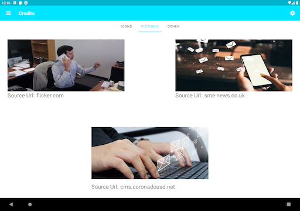

## Acknowledgments
I want to especially thank my teacher Prof. Cai Filiault.
He taught me how to use Android Studio to complete application
development.
